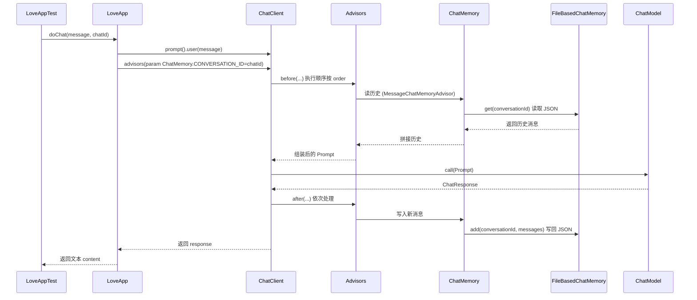

# Part 3: AI应用开发

> 说明：按你的命名要求应为“part3:AI应用开发”，但 Windows 不允许文件名含冒号，因此实际文件名为 `part3-AI应用开发.md`。

## 提交信息
- Commit: `3783954`
- Message: `ai-agent项目第三期内容。开始进入恋爱大师的应用场景，从prompt开始。`
- 目标：基于 Spring AI 搭建“恋爱大师”场景应用，补齐记忆持久化、Advisor 与测试用例。

## 本次新增/修改的功能点
- 业务主流程：新增 `LoveApp` 作为对话入口。
- 记忆持久化：新增 `FileBasedChatMemory`，将会话记录持久化为 JSON。
- 自定义 Advisor：新增 `MyLoggerAdvisor` 与 `ReReadingAdvisor`。
- 测试用例：新增 `LoveAppTest` 覆盖多轮对话与结构化输出。

## 调用链时序图（更细）

## 关键类与技术细节（含实现思路）

### 1) LoveApp（核心对话流程）
设计思路：把“系统提示词、记忆、Advisor、模型调用”集中在一个入口类，保证调用路径一致、便于扩展。

- 系统提示词：`SYSTEM_PROMPT` 固定模型角色与回答风格。
- 记忆挂载：`MessageChatMemoryAdvisor.builder(chatMemory).build()` 让 ChatClient 自动读写会话历史。
- 会话区分：`ChatMemory.CONVERSATION_ID` 绑定会话 ID，确保多轮对话上下文正确。
- 结构化输出：`doChatWithReport` 使用 `.entity(LoveReport.class)` 将模型输出映射为结构化对象。

### 2) FileBasedChatMemory（文件持久化）
设计思路：实现 `ChatMemory`，最小化存储结构，保证可读性与可迁移性。

- 存储路径：`<项目根>/tmp/chat-memory/{conversationId}.json`。
- 数据格式：`[{ type, text }, ...]`，只持久化类型与文本。
- 序列化方式：使用 `ModelOptionsUtils.OBJECT_MAPPER`，并开启 pretty print 便于人工阅读。
- 读写流程：
1. `add(...)` 读取历史 -> 追加 -> 写回文件。
2. `get(...)` 读取文件 -> 反序列化 -> 可选 `lastN` 截断。
3. `clear(...)` 删除对应会话文件。
- 并发处理：在 `add(...)` 内使用 `synchronized (this)` 防止同实例并发写导致文件损坏。
- 类型还原：根据 `MessageType` 转回 `UserMessage/SystemMessage/AssistantMessage`。

### 3) MyLoggerAdvisor（日志拦截）
设计思路：在模型调用前后统一打点，便于调试与链路观察。

- 同步调用：实现 `CallAdvisor`，在 `adviseCall` 里打印 Prompt 与回复。
- 流式调用：实现 `StreamAdvisor`，使用 `ChatClientMessageAggregator` 聚合后统一记录日志。

### 4) ReReadingAdvisor（重读提示）
设计思路：在模型生成前重复用户问题，降低歧义、提升相关性。

- 通过 `PromptTemplate` 增强 user message。
- 默认模板会重复提问并提示“再读一遍问题”。

## 依赖与配置变化
- 新增依赖：`jsonschema-generator`（结构化输出支持）、`kryo`（二进制序列化预留）。
- .gitignore：新增 `tmp/`，避免提交聊天记录。

## 测试与运行
- `LoveAppTest.TestChat()`：多轮对话 + 记忆验证。
- `LoveAppTest.doChatWithReport()`：结构化输出验证。

## 复盘要点与可扩展方向
- 记忆升级：可扩展为保存 metadata/tool_calls。
- Advisor 组合：与 RAG/工具调用联动。
- 存储升级：文件存储可替换为 Redis/数据库/向量存储。