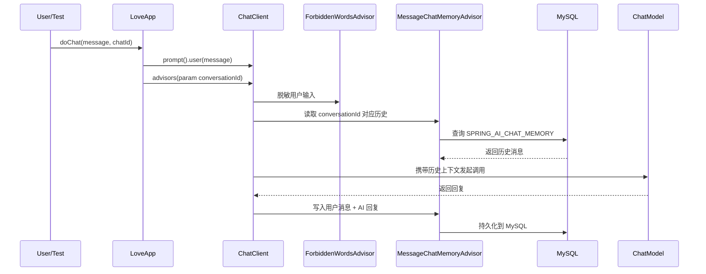

# Part 4: Advisor与MySQL对话记忆

## 1. 背景与目标

在 `LoveApp` 这一轮 AI 应用开发中，我继续做了两个偏工程化的能力补齐：

1. 自定义 `Advisor`，在模型调用前对用户输入做违禁词校验与脱敏。
2. 将对话记忆从本地文件持久化升级为 MySQL 持久化，保证会话上下文可长期保存、可查询、可扩展。

这两个功能的核心目标不是单纯“让 AI 能回答”，而是让应用具备更接近真实业务场景的可控性和可维护性：

- `Advisor` 解决输入治理问题，避免敏感内容直接送入模型。
- MySQL 记忆解决状态持久化问题，避免服务重启后上下文丢失。

## 2. 功能一：自定义违禁词 Advisor

### 2.1 功能目标

在用户消息进入大模型之前，先做一层输入拦截与处理：

- 如果用户输入中包含违禁词，则不直接把原文送给模型。
- 当前采用“脱敏后继续调用模型”的策略，而不是直接拒绝请求。
- 这样既能做基础内容治理，也不会让正常对话流程中断。

### 2.2 为什么选择 Advisor 来做

Spring AI 的 `Advisor` 本质上就是围绕 `ChatClient` 的一个拦截器机制，适合处理这类“模型调用前后增强”的横切逻辑。

把违禁词处理放在 `Advisor` 中，而不是写在业务方法里，有几个直接好处：

- 业务代码和治理逻辑解耦，`LoveApp` 仍然只负责“如何对话”。
- 后续如果还有权限校验、审计日志、Prompt 增强等功能，可以继续按 Advisor 链叠加。
- 同步调用和流式调用都能统一处理。

### 2.3 实现思路

实现类是 `ForbiddenWordsAdvisor`，位于 `src/main/java/com/yusheng/aiagentproject/advisor/ForbiddenWordsAdvisor.java`。

核心实现方式：

1. 实现 `CallAdvisor` 和 `StreamAdvisor`，分别覆盖普通调用和流式调用。
2. 在 `adviseCall` / `adviseStream` 中统一调用 `sanitizeRequest(...)`。
3. 从 `request.prompt().getUserMessage().getText()` 读取用户输入。
4. 调用 `sanitizeText(...)` 执行违禁词匹配与替换。
5. 如果文本发生变化，则通过 `request.prompt().augmentUserMessage(...)` 用脱敏后的内容覆盖最后一条用户消息。

### 2.4 违禁词配置方式

违禁词列表不是写死在代码中，而是通过配置绑定到 `ForbiddenWordsProperties`：

- `src/main/java/com/yusheng/aiagentproject/config/ForbiddenWordsProperties.java`
- `src/main/resources/application.yml`

配置前缀是：

```yml
ai:
  guardrail:
    forbidden-words:
      - 违禁词
      - 敏感词
```

这样做的好处是：

- 修改词库不需要改业务代码。
- 后续可以按环境区分不同词库。
- 便于继续扩展成配置中心或数据库词库。

### 2.5 脱敏策略

当前版本采用了一个简单但稳定的策略：

- 匹配方式：大小写不敏感、子串匹配。
- 脱敏方式：命中词替换为等长的 `*`。

例如：

```text
badword -> *******
```

这样设计的原因是：

- 实现复杂度低，容易验证。
- 对英文大小写和简单变体有一定兼容性。
- 不依赖额外分词工具，适合作为第一版治理能力。

### 2.6 顺序设计

在 `LoveApp` 中，Advisor 注册顺序如下：

1. `ForbiddenWordsAdvisor`
2. `MessageChatMemoryAdvisor`
3. `MyLoggerAdvisor`

这个顺序是刻意设计的，原因是：

- 必须先脱敏，再写入对话记忆。
- 否则即使模型侧收到了脱敏文本，记忆库里仍可能保留原始敏感内容。

也就是说，这里不仅是“保护模型输入”，也是“保护记忆存储”。

### 2.7 测试验证

对应测试是 `src/test/java/com/yusheng/aiagentproject/advisor/ForbiddenWordsAdvisorTest.java`。

当前覆盖了三个核心场景：

1. 大小写不敏感匹配。
2. 子串匹配。
3. 空词库时保持原文不变。

### 2.8 面试表达

可以重点讲三个点：

1. 我没有把内容治理写死在业务方法里，而是基于 Spring AI 的 Advisor 机制做成了横切能力。
2. 我考虑了调用链顺序，确保脱敏发生在记忆入库之前，避免敏感信息落库。
3. 我把词库做成了配置化，为后续接入更复杂的审核机制预留了演进空间。

## 3. 功能二：对话记忆持久化到 MySQL

### 3.1 原始实现的问题

项目最初的记忆实现是 `FileBasedChatMemory`，它会把每个会话保存成一个本地 JSON 文件。

这个方案适合学习和快速验证，但在工程上有明显限制：

- 服务迁移或重启后，文件管理不方便。
- 多实例部署时，无法共享记忆。
- 不利于做查询、统计、运维排查。
- 文件读写在并发场景下扩展性有限。

所以这次把记忆层升级为数据库存储。

### 3.2 为什么选择 Spring AI 内置 JDBC ChatMemory

我没有自己手写一套 `ChatMemory` + `JDBC` 持久化，而是优先使用 Spring AI 官方提供的 JDBC 记忆仓储能力：

- 依赖是 `spring-ai-starter-model-chat-memory-repository-jdbc`
- 底层是 `JdbcChatMemoryRepository`
- 上层通过 `MessageWindowChatMemory` 暴露 `ChatMemory` 能力

这样做的好处：

- 复用框架能力，减少重复造轮子。
- 与 `MessageChatMemoryAdvisor` 集成更自然。
- 表结构初始化、消息读写等基础能力交给框架维护，代码更聚焦业务本身。

### 3.3 依赖与配置

相关依赖位于 `pom.xml`。

新增的关键依赖：

- `spring-boot-starter-jdbc`
- `mysql-connector-j`
- `spring-ai-starter-model-chat-memory-repository-jdbc`

数据源与记忆配置位于：

- `src/main/resources/application.yml`
- `src/main/resources/application-local.yml`

当前关键配置包括：

```yml
spring:
  datasource:
    url: ${MYSQL_URL:jdbc:mysql://localhost:3306/ai-agent-project}
    username: ${MYSQL_USERNAME:root}
    password: ${MYSQL_PASSWORD:}
    driver-class-name: com.mysql.cj.jdbc.Driver
  ai:
    chat:
      memory:
        repository:
          jdbc:
            initialize-schema: always
```

这里 `initialize-schema: always` 的作用是启动时自动初始化 Spring AI ChatMemory 需要的表结构。

默认生成的表是：

```sql
SPRING_AI_CHAT_MEMORY
```

核心字段包括：

- `conversation_id`
- `content`
- `type`
- `timestamp`

### 3.4 业务层如何接入

接入点在 `src/main/java/com/yusheng/aiagentproject/app/LoveApp.java`。

这次最大的结构变化是：

- 不再在 `LoveApp` 里手动 new `FileBasedChatMemory`
- 改为直接注入 `ChatMemory`

也就是说，`LoveApp` 只依赖抽象接口，不关心底层到底是文件、MySQL 还是其他存储。

这属于一个比较标准的依赖倒置思路：

- 业务层只依赖 `ChatMemory`
- 具体实现由 Spring AI 自动配置注入

### 3.5 数据写入链路



关键点有两个：

1. `conversationId` 通过 `ChatMemory.CONVERSATION_ID` 显式传给 Advisor。
2. `MessageChatMemoryAdvisor` 负责自动完成“读历史 + 写新消息”。

### 3.6 迁移思路

从文件记忆切换到数据库记忆时，我采用的是“替换底层实现，不改上层调用方式”的思路：

1. 原先 `LoveApp` 里直接使用 `FileBasedChatMemory`。
2. 现在改为注入 `ChatMemory`。
3. `MessageChatMemoryAdvisor` 的使用方式不变。

这样做的价值在于：

- 业务代码变动小。
- 切换成本低。
- 以后如果要从 MySQL 再迁移到 Redis 或其他存储，仍然可以沿用这套抽象结构。

### 3.7 遇到的问题与排查过程

#### 问题 1：非法字符 `\ufeff`

最初写入 Java 文件时出现了 UTF-8 BOM，导致编译报非法字符。

修复方式：

- 将相关文件改为 UTF-8 无 BOM。
- 后续编辑统一按无 BOM 输出。

#### 问题 2：Lombok getter 未生效

`ForbiddenWordsProperties` 最初依赖 Lombok 生成 `getForbiddenWords()`，但在某些编译场景下未能正确生成。

修复方式：

- 保留 `@Data`
- 同时显式补充 `getForbiddenWords()`，保证编译稳定性。

#### 问题 3：`Failed to determine DatabaseDriver`

最开始 JDBC ChatMemory 初始化失败，根因并不是驱动依赖缺失，而是更底层的数据库不可用。沿着异常链排查到最后一层，最终原因是数据库不存在。

修复方式：

1. 创建对应数据库。
2. 检查 `application.yml` / `application-local.yml` 的数据源配置。
3. 在测试类中增加 `@ActiveProfiles("local")`，确保测试环境加载本地数据源配置。

### 3.8 测试验证

相关测试类：

- `src/test/java/com/yusheng/aiagentproject/app/LoveAppTest.java`
- `src/test/java/com/yusheng/aiagentproject/AiAgentProjectApplicationTests.java`

验证点包括：

1. Spring 容器能够正常启动。
2. `LoveApp` 可以完成多轮对话。
3. 同一个 `chatId` 下，上下文记忆能够参与后续回答。
4. 结构化输出 `LoveReport` 可以正常返回。

`mvn test` 已经通过，这说明数据源连接、ChatMemory 自动配置、Advisor 链与 ChatClient 调用链都已打通。

### 3.9 面试表达

这部分建议重点讲下面四点：

1. 我先用文件存储快速跑通了 ChatMemory，再平滑迁移到 MySQL，实现从 Demo 到工程化的升级。
2. 我没有把持久化逻辑写死在业务层，而是依赖 Spring AI 的 `ChatMemory` 抽象和 JDBC Repository 自动配置。
3. 我通过 `conversationId` 保证多轮对话上下文绑定，并借助 `MessageChatMemoryAdvisor` 自动完成历史读写。
4. 我在落地过程中排查过编码、Lombok、数据库初始化、Profile 加载等问题，说明不仅会写功能，也能处理真实工程环境问题。

## 4. 设计上的关键取舍

### 4.1 为什么违禁词先做“脱敏”，不直接拒绝

第一版优先保证链路通畅，所以采用“治理但不打断”的策略。这样既能控制输入，又不影响用户体验。

如果后续业务要求更严格，可以扩展成：

- 命中后直接抛异常
- 返回固定提示语
- 记录审计日志
- 区分高危词和普通词

### 4.2 为什么先用 MySQL，而不是 Redis

这一轮的目标是“可持久化、可查看、可验证”，MySQL 更适合：

- 方便直接查表验证数据
- 落地门槛低
- 适合做复盘和演示

而 Redis 更适合高性能短期会话缓存，但不一定适合第一版的可追踪与可审计需求。

### 4.3 为什么不继续沿用 FileBasedChatMemory

文件方案保留的意义主要是教学和过渡：

- 它让 ChatMemory 的接口边界足够清晰
- 也使得后续替换为数据库时路径非常自然

但真正在工程实践中，数据库方案更适合继续扩展。

## 5. 后续可优化方向

### 5.1 Advisor 方向

- 支持不同级别违禁词策略
- 增加权限校验 Advisor
- 增加审计日志 Advisor
- 增加 Prompt 注入防护

### 5.2 ChatMemory 方向

- 自定义记忆窗口大小，而不是完全依赖默认值
- 为会话增加用户 ID、业务标签等 metadata
- 提供历史会话查询接口
- 增加会话清理策略和归档策略

### 5.3 配置安全方向

当前本地开发中已经把 MySQL 用户名密码走环境变量占位，但 `application-local.yml` 里仍然可能出现本地敏感信息。更稳妥的做法是：

- `application.yml` 只保留占位符
- `application-local.yml` 不提交远程仓库
- API Key、数据库密码全部通过环境变量注入

## 6. 复盘总结

这两个功能虽然都不算“业务功能本身”，但它们非常关键，因为它们补齐的是 AI 应用真正落地时最常见的两类基础能力：

- 输入治理能力
- 状态持久化能力

如果只做 Prompt 和模型调用，项目更像一个 Demo；把 `Advisor` 和 `ChatMemory` 的工程能力补齐之后，项目才开始具备“面向真实场景演进”的基础。

从技术栈角度看，这一轮我实际掌握的是：

- Spring AI `Advisor` 扩展机制
- Spring AI `ChatMemory` 体系
- `MessageChatMemoryAdvisor` 的接入方式
- JDBC 持久化与 MySQL 配置
- Spring Boot Profile 与测试环境配置
- 常见工程问题排查方法

如果面试官问“你在这个项目里做的最有工程价值的部分是什么”，这一轮可以直接回答：

> 我做了输入治理和会话持久化两块基础能力，把一个只会调用模型的 Demo，推进成了一个具备可控性和可持续扩展能力的 AI 应用雏形。