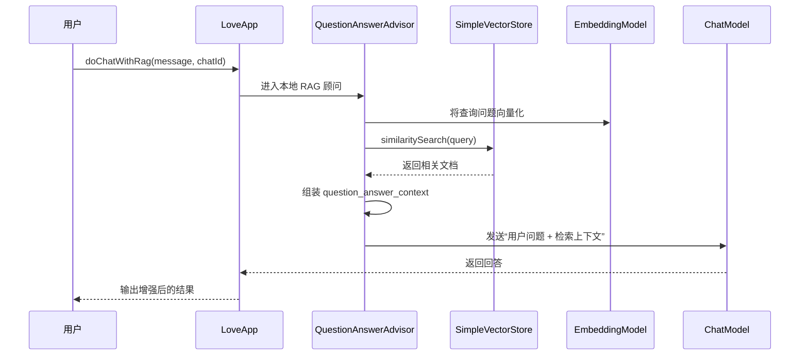
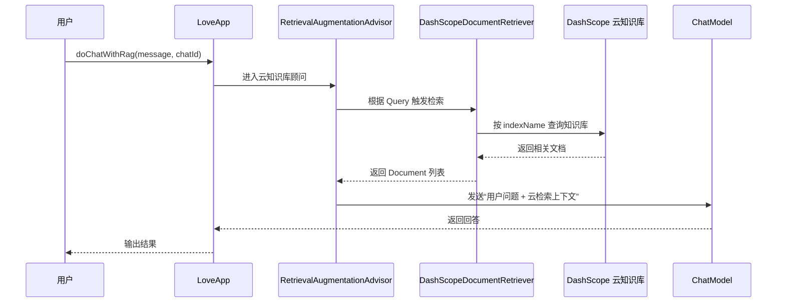

# Part 5 - RAG 知识库基础与实践

## 1. 背景与目标

这一阶段的核心目标，不再只是“让模型能聊天”，而是进一步理解并实践 **RAG（Retrieval-Augmented Generation，检索增强生成）** 的完整工作流程。

结合本分支实际代码，这一阶段主要完成了三件事：

1. 基于 `Spring AI + 本地 Markdown 知识库` 实现本地 RAG。
2. 基于 `Spring AI + DashScope 云知识库` 实现云端 RAG。
3. 在请求链路中加入可观测性，定位“用户问题有没有被改写、检索结果有没有真正注入提示词”。

从学习角度看，这一阶段的重点不是 API 背诵，而是搞清楚下面这条链路：

```text
用户问题 -> 检索知识 -> 拼接上下文 -> 再交给大模型回答
```

如果没有这条检索链路，大模型只能依赖训练时知识和当前对话上下文；如果有了 RAG，就可以把项目自己的知识库动态接入回答过程。

## 2. 本分支的主要改动

相对于 `main` 分支，本阶段新增和调整的内容主要有：

- 在 `pom.xml` 中补充了 JDBC、MySQL、Spring AI JDBC ChatMemory、Markdown 读取器等依赖。
- 在 `src/main/resources/doc/` 下新增三份恋爱主题 Markdown 文档，作为本地知识库原始数据。
- 新增 `LoveAppDocumentLoader`，负责扫描并读取 Markdown 文档。
- 新增 `LoveAppVectorStoreConfig`，负责把文档切分结果写入 `SimpleVectorStore`。
- 在 `LoveApp` 中新增 `doChatWithRag(...)`，接入本地向量检索和云知识库顾问。
- 新增 `LoveAppRagCloudAdvisorConfig`，用于装配 DashScope 云知识库检索顾问。
- 扩展 `MyLoggerAdvisor`，让它既能记录普通请求，也能记录 RAG 改写后的请求。
- 补充 `LoveAppTest#doChatWithRag()`，把 RAG 调用纳入测试入口。

## 3. 什么是 RAG

RAG 的本质可以理解为：

- `Retrieval`：先去知识库里找和用户问题最相关的资料。
- `Augmented`：把这些资料整理成上下文，拼接到提示词里。
- `Generation`：再由大模型基于“用户问题 + 检索结果”生成最终回答。

这和普通聊天最大的不同，是模型不再只依赖“自己脑子里的知识”，而是依赖“当前检索回来的知识”。

## 4. 本地知识库 RAG 的实现

### 4.1 本地知识来源

本地知识库的数据源放在：

- [单身篇](../src/main/resources/doc/恋爱常见问题和回答%20-%20单身篇.md)
- [恋爱篇](../src/main/resources/doc/恋爱常见问题和回答%20-%20恋爱篇.md)
- [已婚篇](../src/main/resources/doc/恋爱常见问题和回答%20-%20已婚篇.md)

这些文件本身并不是直接给模型看的，而是先被读取、切分、向量化，再进入向量库。

### 4.2 文档读取器

本地文档读取逻辑在：

- [LoveAppDocumentLoader](../src/main/java/com/yusheng/aiagentproject/rag/LoveAppDocumentLoader.java)

它做了几件事：

1. 扫描 `classpath:doc/*.md` 下的 Markdown 文件。
2. 使用 `MarkdownDocumentReader` 把 Markdown 内容转成 `Document` 列表。
3. 给每个文档块追加 `filename` 元数据，便于后续定位来源。

它对应的学习重点是：

- 原始知识不一定来自数据库，也可以来自文件系统。
- `Document` 是 Spring AI 中的统一知识载体。
- Markdown 不会被“一整篇原样送给模型”，而是先被解析成可索引的文档块。

### 4.3 向量库装配

本地向量库配置在：

- [LoveAppVectorStoreConfig](../src/main/java/com/yusheng/aiagentproject/rag/LoveAppVectorStoreConfig.java)

核心流程是：

1. 注入 `EmbeddingModel`。
2. 创建 `SimpleVectorStore`。
3. 调用 `LoveAppDocumentLoader.loadMarkdowns()` 读取文档。
4. 使用 `simpleVectorStore.add(documents)` 完成向量化入库。

这里的关键理解是：

- `SimpleVectorStore` 是一个本地内存向量库，适合学习 RAG 的流程。
- `EmbeddingModel` 负责把文本变成向量。
- “写入向量库”本质上就是“把文档文本转换为向量并建立检索索引”。

### 4.4 本地 RAG 在业务中的接入

业务入口在：

- [LoveApp](../src/main/java/com/yusheng/aiagentproject/app/LoveApp.java)

本地 RAG 接入方式是：

```java
.advisors(new QuestionAnswerAdvisor(loveAppVectorStore))
```

`QuestionAnswerAdvisor` 会在调用模型前做三件事：

1. 根据用户问题到 `loveAppVectorStore` 中做相似度检索。
2. 把检索结果拼到 `question_answer_context` 里。
3. 再把增强后的内容一起交给模型生成答案。

### 4.5 本地 RAG 时序图



## 5. 云知识库 RAG 的实现

### 5.1 云知识库顾问配置

云知识库配置在：

- [LoveAppRagCloudAdvisorConfig](../src/main/java/com/yusheng/aiagentproject/config/LoveAppRagCloudAdvisorConfig.java)

这份配置做了两层事情：

1. 通过 `DashScopeApi.builder().apiKey(...).build()` 创建云端 API 客户端。
2. 通过 `DashScopeDocumentRetriever + RetrievalAugmentationAdvisor` 创建云检索顾问。

核心代码可以概括为：

```java
DashScopeApi dashScopeApi = DashScopeApi.builder()
        .apiKey(dashScopeApiKey)
        .build();

DocumentRetriever documentRetriever = new DashScopeDocumentRetriever(
        dashScopeApi,
        DashScopeDocumentRetrieverOptions.builder()
                .withIndexName("恋爱大师")
                .build()
);

return RetrievalAugmentationAdvisor.builder()
        .documentRetriever(documentRetriever)
        .build();
```

### 5.2 云知识库接入点

在 `LoveApp#doChatWithRag(...)` 中，这个顾问通过下面这行接入：

```java
.advisors(loveAppRagCloudAdvisor)
```

也就是说，当前 `doChatWithRag(...)` 这条链路实际上同时串了两类 RAG：

- 本地向量库 RAG：`QuestionAnswerAdvisor(loveAppVectorStore)`
- 云知识库 RAG：`loveAppRagCloudAdvisor`

从学习角度看，这能帮助理解：

- RAG 不等于某一个具体类。
- 只要“先检索，再增强，再生成”，无论底层是本地向量库还是云知识库，本质都是同一类模式。

### 5.3 云知识库的前置条件

云知识库这部分和本地 RAG 最大的不同，是它依赖外部环境：

- 需要正确配置 `spring.ai.dashscope.api-key`
- 需要云端已经存在对应的知识库索引
- 当前代码里索引名写死为 `恋爱大师`

如果云端没有这个索引，就会出现类似错误：

```text
DashScopeException: Index:恋爱大师 NotExist
```

这个报错说明的不是“代码结构有问题”，而是“代码已经调到云端检索了，但云端知识库不存在或不可用”。

### 5.4 云知识库时序图



## 6. 为什么要增强 MyLoggerAdvisor

调试入口在：

- [MyLoggerAdvisor](../src/main/java/com/yusheng/aiagentproject/advisor/MyLoggerAdvisor.java)

这次它的变化不是“单纯多打几条日志”，而是从“只能看普通请求”升级到了“也能看 RAG 改写后的请求”。

它新增了两类能力：

1. 继续支持 `CallAdvisor / StreamAdvisor`，保留原来的普通日志能力。
2. 新增 `CallAroundAdvisor / StreamAroundAdvisor`，记录 `AdvisedRequest` 中的增强内容。

这样做的价值是：

- 能看到 `QuestionAnswerAdvisor` 改写后的 `userText`
- 能看到 `question_answer_context`
- 能看到检索到的文档数量与预览

也就是说，它从“打印日志工具”变成了“RAG 可观测性工具”。

## 7. 配置与依赖变化

### 7.1 依赖变化

这次和 RAG 直接相关的依赖变化主要有：

- `spring-boot-starter-jdbc`
- `mysql-connector-j`
- `spring-ai-starter-model-chat-memory-repository-jdbc`
- `spring-ai-markdown-document-reader`

其中：

- JDBC 和 MySQL 负责承接前一阶段的持久化记忆。
- Markdown Reader 负责把本地知识库文件转换为 `Document`。

### 7.2 application.yml 变化

配置文件位置：

- [application.yml](../src/main/resources/application.yml)

本阶段补充了三类配置：

1. MySQL 数据源
2. Spring AI JDBC ChatMemory 初始化
3. 违禁词配置

这说明当前分支不是孤立地“加了 RAG”，而是在已有 Advisor 和记忆机制之上继续往前推进。

## 8. 测试与运行观察

相关测试在：

- [LoveAppTest](../src/test/java/com/yusheng/aiagentproject/app/LoveAppTest.java)
- [AiAgentProjectApplicationTests](../src/test/java/com/yusheng/aiagentproject/AiAgentProjectApplicationTests.java)
- [ForbiddenWordsAdvisorTest](../src/test/java/com/yusheng/aiagentproject/advisor/ForbiddenWordsAdvisorTest.java)

当前 `LoveAppTest#doChatWithRag()` 能帮助验证三件事：

1. 本地向量库是否完成初始化
2. RAG 调用链是否能真正跑起来
3. 云知识库索引是否已经正确配置

结合本阶段的实际测试现象，可以把错误区分为两类：

- 编译期错误：通常是依赖 API 版本不匹配，例如 `DashScopeApi` 构造器变化。
- 运行期错误：通常是云知识库环境未配置完成，例如 `Index:恋爱大师 NotExist`。

## 9. 关键文件速查

| 文件 | 作用 | 主要学习点 |
| --- | --- | --- |
| `src/main/java/com/yusheng/aiagentproject/app/LoveApp.java` | 业务入口 | 如何把普通对话、结构化输出、本地 RAG、云 RAG 串起来 |
| `src/main/java/com/yusheng/aiagentproject/rag/LoveAppDocumentLoader.java` | 读取 Markdown 知识库 | 原始知识如何转换成 `Document` |
| `src/main/java/com/yusheng/aiagentproject/rag/LoveAppVectorStoreConfig.java` | 装配本地向量库 | 文档如何向量化并进入 `SimpleVectorStore` |
| `src/main/java/com/yusheng/aiagentproject/config/LoveAppRagCloudAdvisorConfig.java` | 云知识库顾问配置 | 如何用 DashScope 接入云端检索 |
| `src/main/java/com/yusheng/aiagentproject/advisor/MyLoggerAdvisor.java` | RAG 调试日志 | 如何观察增强前后请求差异 |
| `src/test/java/com/yusheng/aiagentproject/app/LoveAppTest.java` | RAG 测试入口 | 如何验证本地 RAG 和云 RAG 运行情况 |

## 10. 这次学习真正应该掌握什么

如果只记住“调用了 `QuestionAnswerAdvisor` 就算学会 RAG”，这还是停留在 API 使用层。

这一阶段更重要的理解应该是：

1. **知识源和模型是两层东西。**
   模型负责生成，知识库负责提供外部上下文。

2. **RAG 的关键不在于“有没有知识库”，而在于“知识有没有在生成前注入提示词”。**
   这也是为什么要增强 `MyLoggerAdvisor` 去观察 `question_answer_context`。

3. **本地 RAG 和云 RAG 的核心模式相同，只是检索后端不同。**
   一个查本地向量库，一个查 DashScope 云索引。

4. **工程里的 RAG 不只是功能实现，还包括依赖、配置、调试、测试和环境前置条件。**
   本地知识库看的是文档加载和向量化，云知识库看的是索引、API Key 和外部环境。

## 11. 后续可以继续演进的方向

基于当前代码，后续可以继续往下做：

- 把云知识库索引名从硬编码改成配置项。
- 给本地 RAG 增加检索条数、过滤条件、相似度阈值配置。
- 避免在同一个方法里同时串本地 RAG 和云 RAG，改成可切换策略。
- 在日志中补充命中的知识来源，明确回答来自本地还是云端。
- 为云知识库增加“索引不存在”的兜底处理，避免测试直接抛异常。

## 12. 一句话总结

这一阶段的本质，是把项目从“会聊天的 Spring AI 应用”推进到“能接入知识库、能解释检索过程、能区分本地与云端知识来源的 RAG 应用”。