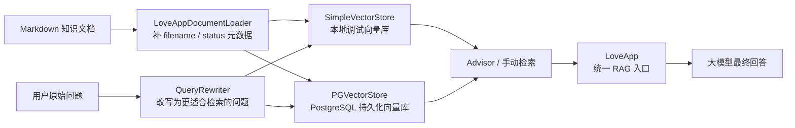
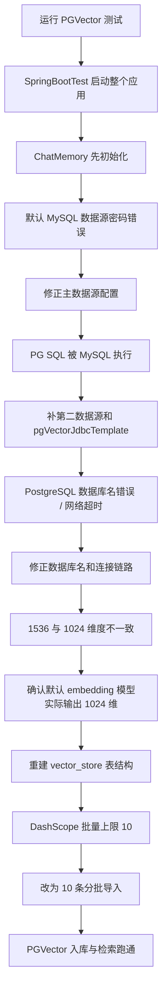
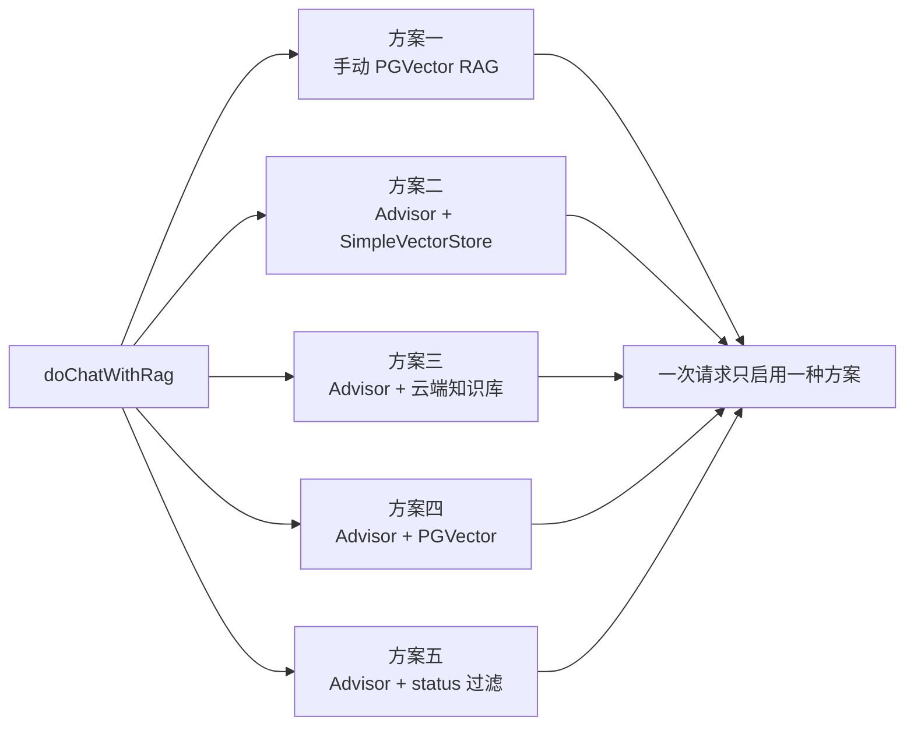
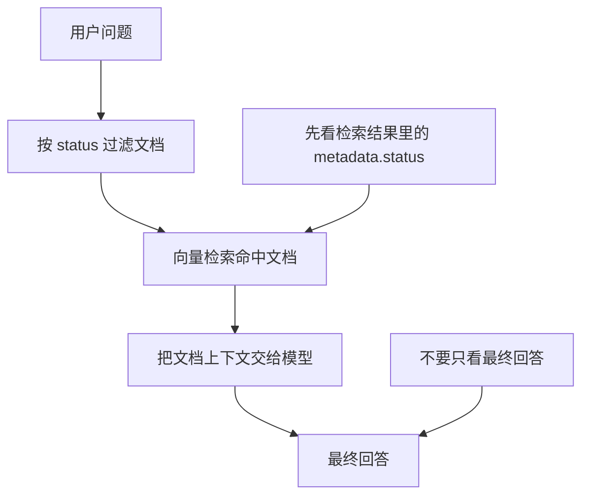

# Part 5 进阶：RAG 知识库进阶设计与排错

本文档记录 `feature/rag-advanced` 分支这一轮 RAG 进阶改造的完整思路，重点不是“代码最后长什么样”，而是“为什么要这样改、排错时是怎么一步一步定位的、每一层方案分别解决什么问题”。

## 目录

- [1. 背景与目标](#1-背景与目标)
- [2. 为什么要继续做这一轮改造](#2-为什么要继续做这一轮改造)
- [3. PGVector 接入：从看起来像配置问题到真正跑通](#3-pgvector-接入从看起来像配置问题到真正跑通)
- [4. 当前 PGVector 配置方案为什么这样设计](#4-当前-pgvector-配置方案为什么这样设计)
- [5. 文档加载器为什么要补 metadata](#5-文档加载器为什么要补-metadata)
- [6. 为什么同时保留本地向量库和 PGVector](#6-为什么同时保留本地向量库和-pgvector)
- [7. QueryRewriter：为什么要把检索问题和最终提问拆开](#7-queryrewriter为什么要把检索问题和最终提问拆开)
- [8. 为什么 LoveApp 最后变成了一个 RAG 总入口](#8-为什么-loveapp-最后变成了一个-rag-总入口)
- [9. 自定义 Advisor 工厂解决了什么问题](#9-自定义-advisor-工厂解决了什么问题)
- [10. 方案五排查：为什么看起来状态改了但回答都还是婚恋相关](#10-方案五排查为什么看起来状态改了但回答都还是婚恋相关)
- [11. 状态过滤测试结论：本地向量库有效，PGVector 当前无效](#11-状态过滤测试结论本地向量库有效pgvector-当前无效)
- [12. 这一轮的核心修改理由汇总](#12-这一轮的核心修改理由汇总)
- [13. 这一轮最重要的经验](#13-这一轮最重要的经验)
- [14. 后续可以继续优化的方向](#14-后续可以继续优化的方向)
- [15. 总结](#15-总结)

## 1. 背景与目标

在 Part 5 的基础 RAG 版本中，项目已经具备了：

- 能读取本地 Markdown 文档并建立知识库。
- 能通过向量检索把相关文档补充到大模型回答中。
- 能切换本地向量库与云端知识库两种知识来源。

但这还只是“能跑起来”的阶段。进入这一轮进阶后，目标变成了四件更工程化的事情：

1. 把知识库从本地简单向量库扩展到 `PostgreSQL + PGVector`。
2. 引入查询重写，让“用户原问题”和“检索问题”分工更清晰。
3. 引入更灵活的 `Advisor` 检索增强方式，而不只依赖一种写法。
4. 给知识库文档补充阶段元数据，让系统可以按 `单身 / 恋爱 / 已婚` 过滤检索结果。

可以把这一轮工作理解成：
前一阶段是在给 AI “准备资料”，这一阶段是在给 AI “准备资料柜、检索规则和查资料的方法”。

### 1.1 本轮改造总览图



## 2. 为什么要继续做这一轮改造

只做最基础的 RAG，通常会遇到三个明显问题：

### 2.1 检索来源不够稳定

`SimpleVectorStore` 很适合学习和调试，但它更像一个“内存里的临时资料夹”：

- 应用重启后需要重新装载。
- 不方便直接查看底层数据。
- 不适合做数据库层面的排查和验证。

因此需要把它升级为真正可持久化的向量库，即 `PGVector`。

### 2.2 用户提问不一定适合直接做检索

用户说的话常常带有情绪、口语、上下文省略。例如：

```text
我最近在亲密关系里有点迷茫，怎么调整？
```

这句话适合聊天，但不一定是最适合向量检索的表达。
所以需要一个“查询重写器”，先把原问题改写为更利于检索的版本，再拿去查知识库。

### 2.3 检索策略需要可切换

这一轮不是要把某一种 RAG 方案写死，而是要把不同方案都整理好，方便后续按场景切换：

- 手动 RAG：适合教学和排错。
- `QuestionAnswerAdvisor`：适合快速接入。
- 自定义 `RetrievalAugmentationAdvisor`：适合做元数据过滤、空上下文控制等更细的行为定制。

## 3. PGVector 接入：从看起来像配置问题到真正跑通

PGVector 这一部分是这一轮里排错链路最长的一段。它非常适合用来说明：
很多“看起来是向量库有问题”的报错，根因其实在更前面的 Spring Boot 启动链路上。

### 3.1 第一个报错并不是 PGVector 自己的错

最开始跑 `PgVectorVectorStoreConfigTest` 时，测试并没有真正执行到 PGVector 写入，而是在 Spring Boot 启动阶段就失败了。

最底层异常是：

```text
Access denied for user 'root'@'localhost' (using password: NO)
```

这说明当时失败点其实是：

- `@SpringBootTest` 启动了整个应用上下文。
- `LoveApp` 依赖了 `ChatMemory`。
- `ChatMemory` 又依赖默认主数据源。
- 默认主数据源此时连的是 MySQL，而且密码没有正确注入。

也就是说，表面上是在测 `PGVector`，实际上先倒在了“主数据源没配好”这一步。

### 3.2 多数据源不是只写 yml 就够了

后面虽然把 MySQL 和 PostgreSQL 的配置分开放到了 yml 里，但这还不够。
原因很简单：Spring Boot 默认只会自动装配“主数据源”，不会因为你在 yml 中写了：

```yml
spring.datasource.pgvector
```

就自动生成第二个可区分的 `DataSource` 和 `JdbcTemplate`。

因此这一轮新增了：

- `src/main/java/com/yusheng/aiagentproject/config/PgVectorDataSourceConfig.java`

它的职责非常明确：

1. 读取 `spring.datasource.pgvector.*`
2. 创建 `pgVectorDataSource`
3. 创建 `pgVectorJdbcTemplate`

这样做的目的，是让：

- MySQL 继续作为主数据源，服务于 `ChatMemory`
- PostgreSQL 专门作为 PGVector 的向量库存储

### 3.3 “CREATE EXTENSION” 跑到 MySQL 上，是一个非常关键的定位信号

后面出现过一个非常典型的报错：

```text
bad SQL grammar [CREATE EXTENSION IF NOT EXISTS vector]
```

更底层却是 MySQL 在报语法错误。

这类异常的含义很明确：
`PGVector` 初始化时该执行 PostgreSQL 语句，但当时注入进去的 `JdbcTemplate` 实际还是 MySQL 的。

因此后来在：

- `src/main/java/com/yusheng/aiagentproject/rag/PgVectorVectorStoreConfig.java`

里，明确使用了：

```java
@Qualifier("pgVectorJdbcTemplate")
```

这一步本质上是在告诉 Spring：

> 这个向量库 Bean 要用 PostgreSQL 的连接，不要拿默认主数据源来顶替。

### 3.4 数据库名错误和网络超时，是第二层环境问题

在真正连接 PostgreSQL 的过程中，还遇到了两类环境问题：

1. 数据库名称写错，导致 PostgreSQL 提示目标库不存在。
2. 通过代理链路访问 RDS 时偶发超时，表现为 JDBC 连接读超时。

这两类问题都说明：
当 Spring AI、Spring Boot、PGVector 都写对以后，仍然要回到最基本的工程事实：

- 连接字符串必须正确。
- 数据库必须真实存在。
- 网络链路必须稳定。

### 3.5 1536 维和 1024 维不一致，说明模型认知和运行事实打架了

后面最关键的一次定位，是下面这个报错：

```text
expected 1536 dimensions, not 1024
```

它的意思不是“PGVector 计算错了”，而是：

- 数据库表按 `1536` 维创建了。
- 运行时真正写入的 embedding 向量却是 `1024` 维。

这里要记住一个很重要的原则：

> 向量维度必须以运行时实际输出为准，而不是以“我以为模型是多少维”为准。

进一步排查后发现：

- 项目没有显式指定 DashScope embedding 模型。
- 自动配置的默认模型是 `text-embedding-v3`。
- 这一轮实际跑出来的 embedding 维度是 `1024`。

所以后续配置统一为 `1024`，并重建了旧的 `vector_store` 表结构。

### 3.6 为什么还要自己做分批写入

后来又遇到一个看似和数据库无关的报错：

```text
HTTP 400 ... batch size is invalid, it should not be larger than 10
```

这不是 PGVector 的数据库问题，而是 DashScope embedding 接口一次最多只允许处理 10 条内容。

因此在：

- `src/main/java/com/yusheng/aiagentproject/rag/PgVectorVectorStoreConfig.java`

中，最终做了两层限制：

1. `maxDocumentBatchSize(10)`
2. 自己再按 10 条一批手动循环 `vectorStore.add(batch)`

这里体现的是一个典型工程思路：
如果已经观察到框架层“理论上会帮你做”的事情在当前组合下不稳定，那就手动把行为收紧到可验证、可控制的方式。

### 3.7 PGVector 排错链路图



## 4. 当前 PGVector 配置方案为什么这样设计

当前 PGVector 核心配置类是：

- `src/main/java/com/yusheng/aiagentproject/rag/PgVectorVectorStoreConfig.java`

它现在承担了三件事：

1. 创建 `PgVectorStore`
2. 指定 `1024` 维、`COSINE_DISTANCE`、`HNSW` 索引等向量检索参数
3. 在表为空时才导入知识库种子文档

之所以加“只在空表时导入”这层判断，是因为早期每次应用启动都会重新把文档入库，导致：

- 知识库内容重复
- 检索结果里出现重复文档
- 排查时很难判断“到底是新数据还是旧数据”

现在它会先检查：

```sql
SELECT COUNT(*) FROM public.vector_store
```

只有结果为 `0` 才执行首次导入。
这样做相当于给 PGVector 种子数据加了一个“只初始化一次”的保护。

## 5. 文档加载器为什么要补 metadata

当前文档加载器是：

- `src/main/java/com/yusheng/aiagentproject/rag/LoveAppDocumentLoader.java`

它不只是把 Markdown 读出来，还给每条文档补了两个元数据：

- `filename`
- `status`

其中 `status` 来自文件名尾部：

- `单身篇` -> `单身`
- `恋爱篇` -> `恋爱`
- `已婚篇` -> `已婚`

这样设计的目的，是让知识库文档不只是“有正文”，还具备“可筛选”的业务标签。
后面做 `status` 过滤，本质上依赖的就是这层元数据。

可以把它理解成：

- 文档正文是“书的内容”
- metadata 是“图书标签”

没有标签，后面就做不了“只从已婚书架里找资料”这种能力。

## 6. 为什么同时保留本地向量库和 PGVector

这一轮没有把 `SimpleVectorStore` 直接删掉，而是保留了：

- `src/main/java/com/yusheng/aiagentproject/rag/LoveAppVectorStoreConfig.java`

这样做是有意的，不是重复建设。

### 6.1 `SimpleVectorStore` 的价值

它更适合：

- 本地快速调试
- 观察 metadata 过滤效果
- 在不依赖数据库状态的前提下验证 RAG 思路

同时，这里还接入了：

- `src/main/java/com/yusheng/aiagentproject/rag/MyKeywordEnricher.java`

用于在文档入库前追加关键词元数据，帮助后续检索和观察。

### 6.2 `PGVector` 的价值

它更适合：

- 持久化存储
- 真实数据库排查
- 接近生产环境的数据行为

因此，这两个向量库在这一轮承担的角色不同：

- `loveAppVectorStore` 更偏调试和实验
- `pgVectorVectorStore` 更偏持久化和工程落地

## 7. QueryRewriter：为什么要把检索问题和最终提问拆开

查询重写器位于：

- `src/main/java/com/yusheng/aiagentproject/rag/QueryRewriter.java`

它使用 `RewriteQueryTransformer` 对用户问题进行预处理。

这里最重要的一点，不是“有没有重写”，而是“重写后的结果该拿去做什么”。

这一轮最后定下来的原则是：

- 改写后的问题，只用于知识库检索
- 最终发给大模型回答的，仍然保留用户原始问题

原因是：

1. 检索优化和回答语义不是同一件事。
2. 用户原话保留了语气、上下文和真实意图。
3. 如果把重写后的内容直接替代用户输入，可能会让最终回答变得生硬，或者丢掉用户表达中的关键信息。

这相当于把一次问答拆成两条不同用途的链路：

- 一条给“图书管理员”查资料
- 一条给“咨询顾问”理解用户本人在说什么

## 8. 为什么 `LoveApp` 最后变成了一个 RAG 总入口

这一轮之后，`LoveApp` 不再只是一段简单的 `chatClient.prompt().user(...).call()`。

它现在更像一个“RAG 方案切换台”，位于：

- `src/main/java/com/yusheng/aiagentproject/app/LoveApp.java`

这里保留了多种方案，并通过注释切换：

1. 手动 PGVector RAG
2. `Advisor + SimpleVectorStore`
3. `Advisor + 云端知识库`
4. `Advisor + PGVector`
5. `Advisor + 自定义 status 过滤`

这样设计的原因，不是为了“把代码写复杂”，而是为了让不同阶段的学习、调试、演示都能在一个统一入口里完成。

### 8.1 手动 RAG 的价值

手动 RAG 会显式写出：

1. 查询重写
2. 相似度检索
3. 文档上下文拼接
4. 最终回答生成

它最适合学习和排错，因为每一步中间结果都能看见。

### 8.2 Advisor RAG 的价值

Advisor 方式把“检索增强”封装成顾问链，更适合：

- 保持业务方法简洁
- 统一复用检索增强逻辑
- 方便扩展过滤、空上下文策略、日志观察等横切能力

### 8.3 为什么同一时刻只建议启用一种 RAG 方式

如果你同时开启：

- 手动检索
- Advisor 自动检索

那么一次提问就会变成“查两遍知识库、拼两次上下文”，这会带来两个问题：

1. 结果难解释，不知道最终回答到底受哪一套检索影响。
2. 排错成本高，因为中间链路变得重复。

因此这轮最终采用的原则是：

> 可以保留多种方案，但同一时刻只打开一种。

### 8.4 LoveApp 中的 RAG 方案切换图



## 9. 自定义 Advisor 工厂解决了什么问题

这一轮新增了两个关键工厂类：

- `src/main/java/com/yusheng/aiagentproject/rag/LoveAppContextualQueryAugmenterFactory.java`
- `src/main/java/com/yusheng/aiagentproject/rag/LoveAppRagCustomAdvisorFactory.java`

它们的作用是把“简单检索”升级为“带业务约束的检索增强”。

### 9.1 `LoveAppRagCustomAdvisorFactory`

这个工厂方法的目标是：

- 按 `status` 过滤文档
- 再做相似度检索
- 最后把检索结果交给 `RetrievalAugmentationAdvisor`

它并不是在“告诉模型当前是什么状态”，而是在更前面的检索层做限定：

> 只允许从某个阶段的文档里找资料。

### 9.2 `LoveAppContextualQueryAugmenterFactory`

这个工厂负责空上下文策略，即：

- 如果经过过滤后仍然没有检索到文档，给模型一个明确提示

这里要特别注意一个理解：

`emptyContextPromptTemplate` 是“给模型的提示词”，不是 Java 代码里的“固定返回值”。
因此当过滤后没有命中文档时，模型不一定逐字输出那句提示，它可能会根据整个提示上下文生成相近语义的回答。

这也是后面验证 `status` 过滤时，不能只靠“看最终一句话长什么样”来判断是否生效的原因。

## 10. 方案五排查：为什么看起来状态改了但回答都还是婚恋相关

这一段是本轮里最容易让人误判的地方。

在 `LoveApp` 的方案五里，使用的是：

- `LoveAppRagCustomAdvisorFactory.createLoveAppRagCustomAdvisor(...)`

表面现象是：

- 把 `status` 改成 `单身`
- 或者改成 `已婚`
- 最终回答看起来都还是恋爱、婚姻、关系类内容

很多时候第一反应会是：

> 过滤是不是根本没生效？

其实不能这么快下结论。

### 10.1 先分清检索层和生成层

要判断过滤有没有生效，应该先看检索层，再看最终生成层。

原因很简单：

- `status` 过滤作用在“查什么文档”
- 最终回答是“模型怎么组织语言”

即使过滤已经生效，只要：

- 系统提示词本来就是婚恋顾问风格
- 用户问题本身也很泛

那么最终回答仍然可能都看起来是“关系建议”。

### 10.2 泛问题不适合验证过滤效果

例如：

```text
我最近在亲密关系里有点迷茫，怎么调整？
```

这个问题太宽了：

- 单身阶段可以回答社交、恋爱焦虑
- 恋爱阶段可以回答沟通、争吵、依赖
- 已婚阶段可以回答亲密感、责任分工、边界

所以就算过滤生效，三类答案也依然都可能属于“婚恋相关建议”。

### 10.3 更可靠的验证方式，是直接看检索结果

为了把“过滤是否生效”和“模型如何回答”拆开，本轮补了一个专门的验证测试：

- `src/test/java/com/yusheng/aiagentproject/rag/LoveAppRagStatusFilterTest.java`

这个测试故意不走最终大模型生成，只看：

- 给定 `status`
- 给定 query
- 检索器最终拿到了哪些文档

这样做的意义是：

> 先证明图书管理员拿的是哪一排书，再看顾问最后怎么组织语言。

### 10.4 状态过滤验证图



## 11. 状态过滤测试结论：本地向量库有效，PGVector 当前无效

这一轮排查后，状态过滤得出了一个非常清楚的结论。

### 11.1 `loveAppVectorStore` 上，`status` 过滤是有效的

原因是：

- 文档加载器会补 `status`
- 本地向量库装入的是当前最新文档
- 检索测试能证明返回结果的 metadata 与过滤条件一致

因此，对 `SimpleVectorStore` 这条链来说：

- `status=单身` 时，能稳定拿到单身文档
- `status=已婚` 时，能稳定拿到已婚文档

这说明方案五的“按阶段过滤检索”这一层设计是成立的。

### 11.2 `pgVectorVectorStore` 上，`status` 过滤当前并没有生效

这不是工厂方法写错，而是数据库里的历史数据状态不对。

前面的 SQL 排查已经说明：

```sql
SELECT metadata FROM public.vector_store LIMIT 5;
SELECT count(*) FROM public.vector_store WHERE metadata ->> 'status' = '已婚';
SELECT count(*) FROM public.vector_store WHERE metadata ->> 'status' = '单身';
```

查不到带 `status` 的结果。

这意味着：

- 现在 PostgreSQL 里的旧向量数据，是在补 `status` 元数据之前导进去的。
- 后来虽然代码变了，但因为 `PgVectorVectorStoreConfig` 只在空表时才重新导入。
- 旧数据没有被重建，所以过滤条件匹配不到。

所以当前的准确结论是：

- `status` 过滤逻辑本身没问题。
- `PGVector` 这一支当前缺的是“带正确 metadata 的重建数据”。

## 12. 这一轮的核心修改理由汇总

把本轮所有关键修改压缩成一句话，就是：

> 不是只让 RAG 能用，而是让 RAG 的检索来源、检索方式、检索约束和排错路径都变得清楚、可验证、可切换。

具体展开如下：

### 12.1 新增 `PgVectorDataSourceConfig`

原因：
多数据源不能只靠 yml，必须把 PostgreSQL 的 `DataSource` 和 `JdbcTemplate` 明确建出来。

目的：
让 MySQL 继续服务 `ChatMemory`，让 PostgreSQL 专门服务 PGVector。

### 12.2 调整 `PgVectorVectorStoreConfig`

原因：
PGVector 需要明确使用 PostgreSQL 的 `JdbcTemplate`，还要解决维度、批量导入和重复灌库问题。

目的：
让向量库能够稳定创建、正确入库、避免重复导入。

### 12.3 增强 `LoveAppDocumentLoader`

原因：
文档只有正文还不够，后续要做阶段过滤。

目的：
给文档补 `status` 和 `filename`，让知识库从“能检索”升级为“可筛选”。

### 12.4 新增 `MyKeywordEnricher`

原因：
本地向量库在调试阶段需要更多可观察信息。

目的：
给文档补关键词元数据，便于检索效果观察和后续扩展。

### 12.5 新增 `QueryRewriter`

原因：
用户原始表达不一定适合直接做检索。

目的：
把聊天问题改写为更适合相似度搜索的表达，同时不影响最终回答仍基于用户原话。

### 12.6 新增自定义 Advisor 工厂

原因：
默认顾问只能做普通检索，不够灵活。

目的：
支持 `status` 过滤和空上下文策略，让 RAG 更接近真实业务约束。

### 12.7 重构 `LoveApp`

原因：
RAG 方案逐渐增多，如果仍然把逻辑散写在一个方法里，会越来越难切换和排错。

目的：
把 `LoveApp` 变成统一入口，通过注释切换当前启用的 RAG 方案。

## 13. 这一轮最重要的经验

### 13.1 很多 RAG 报错其实不是 RAG 本身的问题

最开始看起来像是 PGVector 配置失败，实际上先出错的是：

- 默认 MySQL 数据源
- Spring Boot 上下文启动
- ChatMemory 初始化

所以排错时一定要看最底层异常，不要被最外层的 `UnsatisfiedDependencyException` 吓住。

### 13.2 向量维度不要靠猜，要以运行时输出为准

模型是多少维，不应该靠记忆或想当然，而应该以实际写入时报错和运行结果为准。

### 13.3 最终回答文本，不适合作为唯一验证依据

只看大模型最后说了什么，很容易误判。
更稳妥的顺序应该是：

1. 看检索问题是什么。
2. 看检索命中了什么文档。
3. 再看最终回答如何组织这些内容。

### 13.4 能切换比只保留一种写法更适合学习和演进

这一轮没有急着删掉所有旧方案，而是把它们保留在 `LoveApp` 里，通过注释切换。
对学习和排错来说，这种方式非常实用，因为不同方案的优缺点可以被直接对比出来。

## 14. 后续可以继续优化的方向

### 14.1 重建 PGVector 数据

如果希望方案五在 PGVector 上也按 `status` 生效，下一步最直接的动作是：

- 清理旧的 `public.vector_store`
- 按当前文档加载逻辑重新导入带 `status` 的知识数据

### 14.2 把状态过滤对最终回答的约束再加强

如果希望“单身”和“已婚”在最终回答层面看起来更明显不同，可以继续加强两层：

1. 检索层：确保过滤结果稳定命中。
2. 提示词层：明确要求模型只依据当前阶段文档作答，命中为空时不要泛化到其他阶段。

### 14.3 为不同 RAG 方案补更清晰的专项测试

当前已经有：

- `PgVectorVectorStoreConfigTest`
- `LoveAppRagStatusFilterTest`

后续还可以继续细化：

- 手动 RAG 的查询重写测试。
- Advisor RAG 的上下文注入测试。
- PGVector 重建后的 `status` 过滤测试。

## 15. 总结

这一轮 RAG 进阶，不只是新增了几个类，而是把知识库系统从“会查资料”推进到了“会按规则查资料、能解释为什么这么查、出现问题时知道从哪一层开始排”。

如果用一个类比来总结：

- `LoveAppDocumentLoader` 负责把书整理好并贴标签。
- `QueryRewriter` 负责把用户的口语问题改成更像图书检索词。
- `VectorStore` 负责真正去资料库里找书。
- `Advisor` 负责规定“这次允许查哪一排书”。
- `LoveApp` 负责把这些能力串起来，决定当前到底采用哪一种查法。

因此，这一轮真正补齐的，不只是一个 PGVector 功能点，而是一整套更接近真实工程的 RAG 设计与排错能力。